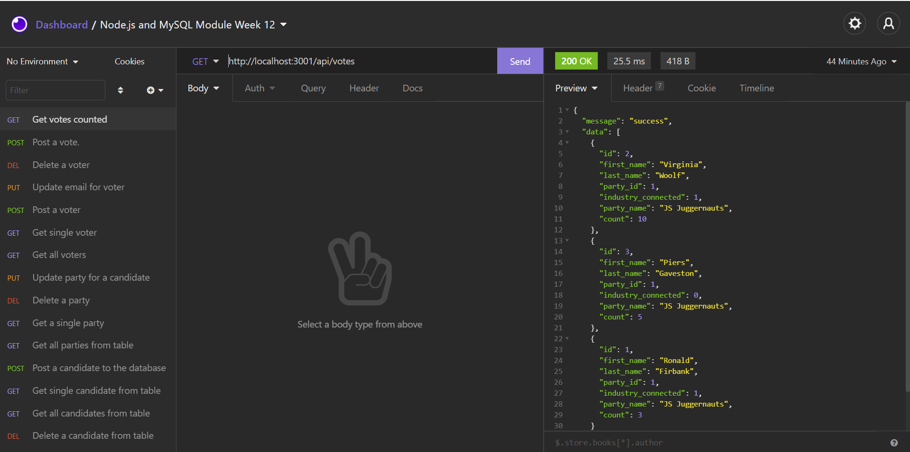

# U-Develop-It

# Description

In this module, I built the back end for U Vote It, a voting application for a local developer meetup group called U Develop It. In addition to building the Express.js API, which I already know how to create, I connected the back end to a relational database using MySQL.



# Pre-requisites

- Install [Node.js](https://nodejs.org/en/) version 8.0.0

# Getting started

- Clone the repository

```
git clone <git@github.com:shanebramble/u-develop-it.git> 
```

- Install dependencies

```
cd <project_name>
npm install
```

- Build and run the project

```
npm start
```

### Built With

- JavaScipt
- Node.js
- MySQL

## Contribution

Made with ❤️ by Shane Bramble-Wade

### ©️2021 U-Develop-It, Inc
